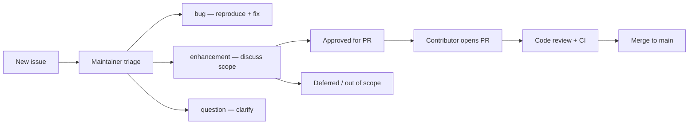

# Contributing to Kheru

Thank you for helping improve Kheru. This project turns scripts into multi-speaker spoken audio — **podcast and long-form episodes first**, starting with **English (US) Kokoro**, with room to grow into other dialects and languages through community contributions.

## Before you start

1. Read the [strategy map](docs/strategy-map.md) (full product plan index) and [architecture guide](docs/architecture.md).
2. Set up the dev environment (below).
3. For non-trivial work, **open an issue first** — especially for new voices, locales, or TTS engines. That saves rework if the approach does not fit project direction.

## Development setup

```bash
git clone https://github.com/iCTX0780/kheru.git && cd kheru
nvm use
pnpm install
make dev
```

Open [http://127.0.0.1:3000](http://127.0.0.1:3000).

First Kokoro synthesis downloads the model in the browser (~5–15 MB).

### Useful commands

| Command | Purpose |
|---------|---------|
| `make dev` | Dev server (studio UI; TTS runs in the browser) |
| `make test` | Unit tests |
| `make typecheck` | TypeScript check |
| `make build` | Production build |
| `make docker-build` / `make docker-run` | Run the same studio in Docker |

### Environment

Copy `apps/kheru/.env.example` to `apps/kheru/.env.local` if you need local overrides. Kokoro runs in the browser — no TTS server env vars are required. Do not commit secrets or local `.env` files.

See [apps/kheru/docs/client-tts.md](apps/kheru/docs/client-tts.md).

## How to contribute

### Small fixes

Typos, test gaps, clear bugs with reproduction steps — PRs welcome without a prior issue.

### Features and larger changes

1. Open a [feature request](.github/ISSUE_TEMPLATE/feature_request.yml) (or comment on an existing one).
2. Wait for maintainer feedback on approach — especially for locale/dialect work.
3. Fork, branch, implement, test.
4. Open a PR against `main` with a clear description and test plan.

### Pull request checklist

- [ ] `make test` passes
- [ ] `make typecheck` passes
- [ ] Changes are scoped to the stated issue
- [ ] New behavior has tests when practical (glossary, chunking, export)
- [ ] User-facing changes are noted in PR description (no need for a CHANGELOG unless asked)

### Code style

- Match existing patterns in the file you edit (TypeScript, React 19, TanStack Start).
- Prefer extending `voice-catalog.ts`, `tts-prepare-text.ts`, and shared `lib/` helpers over duplicating logic in components.
- Keep comments for non-obvious business rules only.
- Minimize diff size — do not refactor unrelated code in the same PR.

### Branch naming (suggested)

- `fix/short-description`
- `feat/short-description`
- `docs/short-description`

## Issues and feature requests

We use GitHub Issues with templates so reports are actionable.

### Bug reports

Use the [bug report template](.github/ISSUE_TEMPLATE/bug_report.yml) when something breaks.

Include:

- Steps to reproduce
- Expected vs actual behavior
- Browser and OS
- Relevant logs or screenshots

**Good bug:** "Generate all on a 12-paragraph script stalls after paragraph 8 in Chrome 138 on macOS — console shows OPFS write failure."

**Weak bug:** "Generate doesn't work."

### Feature requests

Use the [feature request template](.github/ISSUE_TEMPLATE/feature_request.yml).

Include:

- Problem you are solving (user story)
- Proposed solution or sketch
- Whether it is locale/dialect/voice related
- Willingness to implement it yourself

### How we triage

| Label | Meaning |
|-------|---------|
| `bug` | Confirmed defect |
| `enhancement` | Feature or improvement |
| `good first issue` | Small, well-scoped starter task |
| `help wanted` | Maintainers welcome PRs |
| `locale` | Dialect, language, or regional voice work |
| `question` | Needs discussion before coding |

**Typical flow:**



### Project focus (what we prioritize)

**In scope and welcome:**

- Podcast / long-form episode quality (stitch, crossfade, export packs)
- English speech quality (pronunciation, chunking, studio UX)
- Kokoro voice curation, host presets, and previews
- Browser-local TTS improvements
- Export formats, playback sync, and `.kheru` playpack writer (when scheduled)
- Documentation and tests
- **New English dialects** when Kokoro (or a contributed engine) supports them

**Discuss before building:**

- New TTS engines (Piper, XTTS, cloud APIs)
- Non-English languages (chunking, UI, voice catalog design)
- Large UI redesigns
- Hosted SaaS / multi-tenant infrastructure / Stripe entitlements
- Tauri desktop shell or Expo player scaffolds (see docs — drafted, not current work). **Never add `apps/kheru-player` here** — Player lives in private [`iCTX0780/kheru-player`](https://github.com/iCTX0780/kheru-player).
- Voice cloning for branded podcast hosts (not a near-term promise)

**Likely out of scope:**

- Voice cloning or training pipelines as a core feature
- Real-time conversational TTS / OS-wide dictation
- Features that require sending script text to third-party cloud APIs by default
- Reviving HTML/LRC lyrics export workarounds (superseded by Kheru Player brief)

Product direction: [docs/strategy-map.md](docs/strategy-map.md) · [docs/product-vision.md](docs/product-vision.md) · [docs/roadmap.md](docs/roadmap.md).

If you are unsure, open a feature request — a short "is this in scope?" issue is fine.

## Sharing this repo with collaborators

See [docs/sharing.md](docs/sharing.md). Invite people to **`kheru` only** — never to `kheru-player` unless they are building Player.

## Reporting security issues

Do not open public issues for security vulnerabilities. Email the maintainer privately (see GitHub profile contact) with steps to reproduce.

## License

By contributing, you agree that your contributions will be licensed under the same license as the project. (Add a `LICENSE` file to the repo if one is not yet published — contributors should check the repository root before submitting.)

## Recognition

Contributors are credited in PR history. Significant features may be called out in release notes when the project publishes them.

---

Questions? Open a [feature request](.github/ISSUE_TEMPLATE/feature_request.yml) with the **question** label or start a GitHub Discussion if the repo has it enabled.
