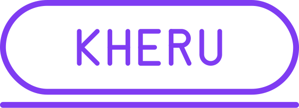

<p align="center">
  <picture>
    <source media="(prefers-color-scheme: dark)" srcset="docs/brand/kheru-wordmark-white.png">
    
  </picture>
</p>

<p align="center">
  Local, offline multi-speaker TTS studio.<br>
  Write a script, assign Kokoro voices, generate on-device, and export WAV / ZIP / <code>.kheru</code>.
</p>

<p align="center">
  
  
  
  
</p>

---

Kheru runs entirely on your machine. Projects live in IndexedDB, audio persists in OPFS, and TTS inference happens on-device. There is **no remote TTS service** — the app you install is the whole thing.

## Two ways to run Kheru

| | Docker (GHCR) | Desktop app (Tauri) |
|---|---|---|
| **How you get it** | `docker pull` a published image | Download an installer for your OS |
| **Install size** | ~200 MB image | ~150 MB app, model bundled inside |
| **Requires** | Docker or [OrbStack](https://orbstack.dev/) | Nothing — self-contained bundle |
| **Runs as** | Local web server on `:3000` | Native window (dock icon, native Save-As) |
| **Model download** | On first synthesis (~5–15 MB, cached in browser) | Bundled — offline-from-launch |
| **Native Save-As** | No (browser download) | Yes (OS file dialog) |
| **GPU / accelerator** | Browser-only (WebGPU/WASM) | CoreML on macOS today; DirectML / CUDA tracked in [#14](https://github.com/iCTX0780/kheru/issues/14) |

Both paths ship the same UI and the same feature set. Pick whichever fits how you work.

### Path 1 — Docker (GHCR)

Requires [Docker](https://docs.docker.com/get-docker/) or [OrbStack](https://orbstack.dev/).

```bash
docker run --rm -p 3000:3000 -e HOST=0.0.0.0 -e PORT=3000 ghcr.io/ictx0780/kheru:latest
```

Open [http://127.0.0.1:3000](http://127.0.0.1:3000).

Prefer compose? Clone the repo and `docker compose up` (see `docker-compose.yml`).

The container serves the static app; **TTS still runs inside your browser** via `kokoro-js` — no synthesis happens on the server. If the GHCR image is private, sign in first: `echo $GITHUB_TOKEN | docker login ghcr.io -u <you> --password-stdin`.

Images are published to GHCR automatically on every GitHub release — see [`.github/workflows/release.yml`](.github/workflows/release.yml).

### Path 2 — Desktop app (Tauri)

Kheru ships as a first-class desktop app: native window, native file dialogs, and on-device Rust-based Kokoro inference (no browser layer for TTS).

**Prebuilt installers** — coming with the next release. When available they'll live on the [Releases page](https://github.com/iCTX0780/kheru/releases): `.dmg` (macOS Universal), `.msi` / `.exe` (Windows x64), `.AppImage` / `.deb` (Linux x64).

**Build it locally** (macOS 26 Tahoe is the primary target):

Prerequisites: Rust toolchain + platform build tools — see [Tauri prerequisites](https://v2.tauri.app/start/prerequisites/).

```bash
git clone https://github.com/iCTX0780/kheru.git && cd kheru
nvm use                          # Node 22+ (see .nvmrc)
pnpm install
pnpm tauri:build                 # produces .app + .dmg on macOS
```

Artifacts land under `src-tauri/target/release/bundle/`. On macOS the installable `.dmg` is at:

```
src-tauri/target/release/bundle/dmg/Kheru_<version>_<arch>.dmg
```

Because the build isn't code-signed yet, macOS Gatekeeper will refuse the first launch. Right-click the app → **Open** → **Open** to authorize it once. Signing + notarization are on the roadmap.

**Studio views** — the desktop app ships an **Editor** view (3-pane IDE for writing) and a **Presenter** view (Google Meet + SILO aesthetic: speaker tiles, ambient waveform, rolling word-highlighted transcript). Toggle with `⌘⇧P`.

See [docs/desktop.md](docs/desktop.md) for on-disk paths, TTS compute-backend picker (CPU / GPU / Auto), and known macOS CoreML acceleration limits.

## Local development

```bash
git clone https://github.com/iCTX0780/kheru.git && cd kheru
nvm use                          # Node 22+
pnpm install
pnpm dev                         # web app on :3000
pnpm tauri:dev                   # desktop app in dev mode (Vite + Rust hot reload)
```

Rust code lives under `src-tauri/`; the repo root is a Cargo workspace so `cargo check` / `cargo fmt` / `cargo test` work from anywhere.

## What it does

| Step | In the app |
|------|------------|
| Write | Paragraph blocks with per-speaker voice + speed |
| Generate | One paragraph, selection, or full mix |
| Review | Timeline playback, word-level highlights, Presenter stage |
| Export | Full mix WAV, per-paragraph ZIP, Playpack `.kheru` bundle |

## Scripts

| Command | Purpose |
|---------|---------|
| `pnpm dev` | Web dev server on :3000 |
| `pnpm tauri:dev` | Desktop app in dev mode |
| `pnpm build` | Production web build (Nitro server bundle) |
| `pnpm tauri:build` | Desktop app bundles (.dmg / .msi / .AppImage / .deb) |
| `pnpm start` | Run production web server (after `build`) |
| `pnpm test` | Unit tests (Vitest) |
| `pnpm typecheck` | TypeScript check |

## Docs

- [docs/desktop.md](docs/desktop.md) — Tauri build notes, data locations, compute backend
- [docs/client-tts.md](docs/client-tts.md) — browser Kokoro / OPFS notes
- [docs/how-to-use.md](docs/how-to-use.md) — walkthrough for new users
- [CONTRIBUTING.md](CONTRIBUTING.md) — setup and PR checklist

## Feedback

Ideas, bugs, and UX notes are welcome via [GitHub Issues](https://github.com/iCTX0780/kheru/issues). When reporting bugs, please include OS, delivery path (Docker vs Tauri), and repro steps.

## License

Licensed under the [Apache License 2.0](LICENSE).
